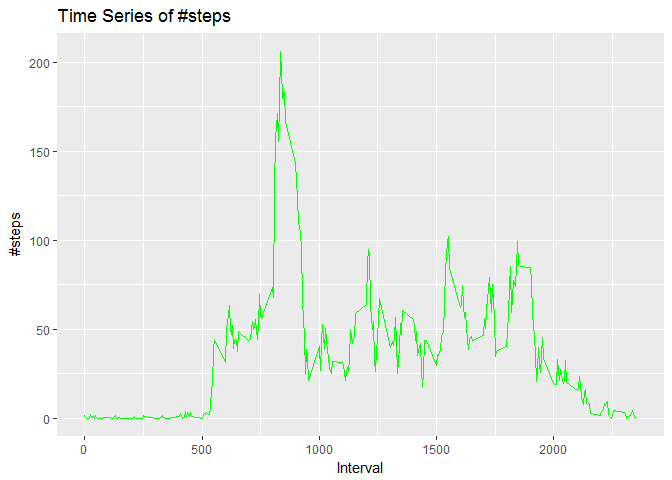
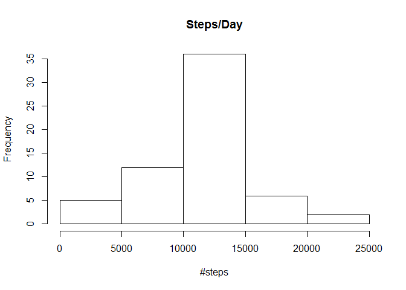
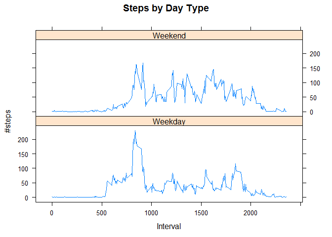

# PA1_template
KJ Sherman  
July 30, 2017  

Loading and preprocessing the data
==================================

1. Load libraries for later use


```r
  library(ggplot2)
```

```
## Warning: package 'ggplot2' was built under R version 3.4.1
```

```r
  library(plyr)
```

```
## Warning: package 'plyr' was built under R version 3.4.1
```

```r
  library(dplyr)
```

```
## Warning: package 'dplyr' was built under R version 3.4.1
```

```
## 
## Attaching package: 'dplyr'
```

```
## The following objects are masked from 'package:plyr':
## 
##     arrange, count, desc, failwith, id, mutate, rename, summarise,
##     summarize
```

```
## The following objects are masked from 'package:stats':
## 
##     filter, lag
```

```
## The following objects are masked from 'package:base':
## 
##     intersect, setdiff, setequal, union
```

2. Load the data (i.e. read.csv())


```r
  AMData <- read.csv("activity.csv")
```

3. Process/transform the data (if necessary) into a format suitable for your analysis.

- Convert to dates and format


```r
  AMData$day <- weekdays(as.Date(AMData$date))
```

What is mean total number of steps taken per day?
=================================================

1. Calculate the total number of steps taken per day

```r
  steps<- AMData%>% group_by(date)%>% filter(!is.na(steps))%>%summarise( steps = sum(steps, na.rm=TRUE))
```

```
## Warning: package 'bindrcpp' was built under R version 3.4.1
```

```r
  steps
```

```
## # A tibble: 53 x 2
##          date steps
##        <fctr> <int>
##  1 2012-10-02   126
##  2 2012-10-03 11352
##  3 2012-10-04 12116
##  4 2012-10-05 13294
##  5 2012-10-06 15420
##  6 2012-10-07 11015
##  7 2012-10-09 12811
##  8 2012-10-10  9900
##  9 2012-10-11 10304
## 10 2012-10-12 17382
## # ... with 43 more rows
```

2. Make a histogram of the total number of steps taken each day


```r
  hist(steps$steps,  xlab = "#steps", main = "Steps/Day")
```

<!-- -->

3. Calculate and report the mean and median of the total number of steps taken per day


```r
  mean <- mean(steps$steps, na.rm=TRUE)
  mean
```

```
## [1] 10766.19
```

```r
  median <- median(steps$steps, na.rm=TRUE)
  median
```

```
## [1] 10765
```

What is the average daily activity pattern?
===========================================

1. Make a time series plot (i.e. type = "l") of the 5-minute interval (x-axis) and the average number of steps taken, averaged across all days (y-axis)

- Prep data

```r
  pattern<- AMData%>% group_by(interval)%>% summarise( steps = mean(steps, na.rm=TRUE))
 pattern
```

```
## # A tibble: 288 x 2
##    interval     steps
##       <int>     <dbl>
##  1        0 1.7169811
##  2        5 0.3396226
##  3       10 0.1320755
##  4       15 0.1509434
##  5       20 0.0754717
##  6       25 2.0943396
##  7       30 0.5283019
##  8       35 0.8679245
##  9       40 0.0000000
## 10       45 1.4716981
## # ... with 278 more rows
```

- Plot

```r
  g <- ggplot(pattern, aes(x=interval, y=steps), xlab = "Interval", ylab="#steps")
  g + geom_line(col = "green")+xlab("Interval")+ylab("#steps")+ggtitle("Time Series of #steps")
```

<!-- -->

2. Which 5-minute interval, on average across all the days in the dataset, contains the maximum number of steps?

```r
  pattern[which.max(pattern$steps),]
```

```
## # A tibble: 1 x 2
##   interval    steps
##      <int>    <dbl>
## 1      835 206.1698
```

Imputing missing values
=======================
Note that there are a number of days/intervals where there are missing values (coded as NA). The presence of missing days may introduce bias into some calculations or summaries of the data.

1. Calculate and report the total number of missing values in the dataset (i.e. the total number of rows with NAs)

```r
  AMData2<- AMData
  nrow(AMData2[is.na(AMData2$steps),])
```

```
## [1] 2304
```

2.Devise a strategy for filling in all of the missing values in the dataset. The strategy does not need to be sophisticated. For example, you could use the mean/median for that day, or the mean for that 5-minute interval, etc.

-My strategy is using the mean for each day
-find NA's

```r
  na<- is.na(AMData2$steps)
```

3. Create a new dataset that is equal to the original dataset but with the missing data filled in.

```r
  mean <- tapply(AMData2$steps, AMData2$interval, mean, na.rm=TRUE, simplify = TRUE)
  AMData2$steps[na] <- mean[as.character(AMData2$interval[na])]
```

4. Make a histogram of the total number of steps taken each day and Calculate and report the mean and median total number of steps taken per day. Do these values differ from the estimates from the first part of the assignment? What is the impact of imputing missing data on the estimates of the total daily number of steps?

-Histogram (recalculate total steps)

```r
  steps<- AMData2%>% group_by(date)%>% summarise( steps = sum(steps))
  hist(steps$steps, breaks = 7,  xlab = "#steps", main = "Steps/Day")
```

<!-- -->

-Mean and Median

```r
  mean <- mean(steps$steps, na.rm=TRUE)
  mean
```

```
## [1] 10766.19
```

```r
  median <- median(steps$steps, na.rm=TRUE)
  median
```

```
## [1] 10766.19
```

```r
  steps
```

```
## # A tibble: 61 x 2
##          date    steps
##        <fctr>    <dbl>
##  1 2012-10-01 10766.19
##  2 2012-10-02   126.00
##  3 2012-10-03 11352.00
##  4 2012-10-04 12116.00
##  5 2012-10-05 13294.00
##  6 2012-10-06 15420.00
##  7 2012-10-07 11015.00
##  8 2012-10-08 10766.19
##  9 2012-10-09 12811.00
## 10 2012-10-10  9900.00
## # ... with 51 more rows
```

-Do these values differ from the estimates from the first part of the assignment?

*The value of the median does differ while the value of the mean remains the same*

What is the impact of imputing missing data on the estimates of the total daily number of steps?

*The total # of daily steps does not change significantly but the frequency in which it happens increases*

Are there differences in activity patterns between weekdays and weekends?
=========================================================================

-For this part the weekdays() function may be of some help here. Use the dataset with the filled-in missing values for this part.

1.Create a new factor variable in the dataset with two levels - "weekday" and "weekend" indicating whether a given date is a weekday or weekend day.

- Modify dataset

```r
AMData2$Type <- ifelse(AMData2$day %in% c("Saturday", "Sunday"), "Weekend", "Weekday")
```

2.Make a panel plot containing a time series plot (i.e. type = "l") of the 5-minute interval (x-axis) and the average number of steps taken, averaged across all weekday days or weekend days (y-axis). See the README file in the GitHub repository to see an example of what this plot should look like using simulated data.

-load lattice


```r
library(lattice)
```


-Plot

```r
finalData <- ddply(AMData2, .(interval, Type), summarize, Avg = mean(steps))

xyplot(Avg~interval|Type, data=finalData, type="l",  layout = c(1,2),
       main="Steps by Day Type", 
       ylab="#steps", xlab="Interval")
```

<!-- -->
